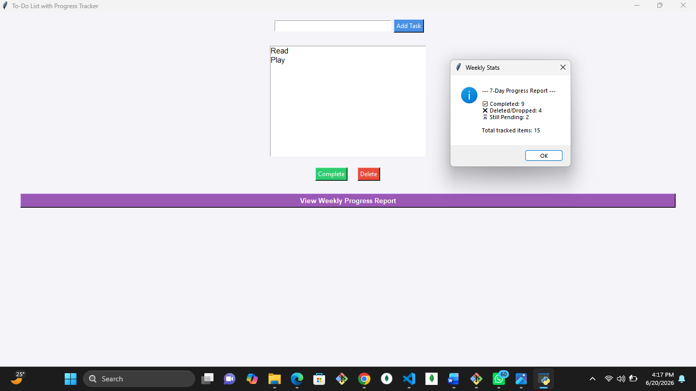
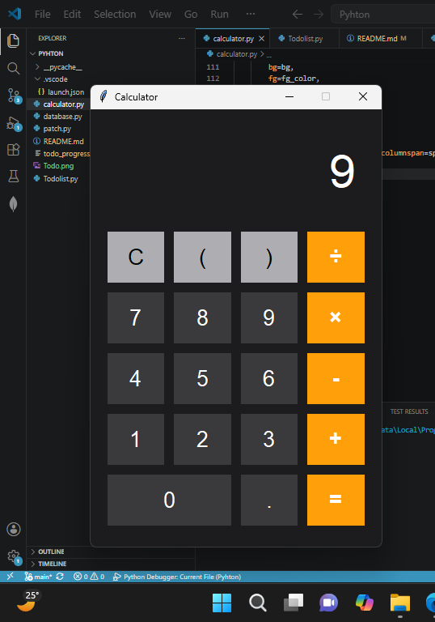

<h1>Project Documentation</h1>

This Repository Contains The project built by Computer Science Eduication Department.

<h2>The projects conatin in this repository are listed below</h2>
<ul>
<li>Todo list</li>
<li>Calculator</li>
</ul>
<h1>TodoList functions</h1>
<li>Addtask: The User can add a task.</li>
<li>Complete Task:  User can Checkout task that has been completed.</li>
<li>Delete Task: User can delete Task has was not completed of failed to achieve.</li>
<h2>Weekly progress report: User can view their weekly or monthly progress which includes the following.</h2>
<li>Task deleted:Which includes task that was deleted.</li>
<li>Task Completed: Which includes task that was completed.</li>
<li>Task Added: Which includes task that got added.</li>
<li>Total tracked task: Which includes all the task.</li>
<li>Still pending task: Which includes task that has  been added but has not been completed neither deleted.</li>
<h3>Live Demo</h3>

<h1>Calculator Functions </h1>
<li>Basic Arithemetic operation such as:</li>
<li>Addition</li>
<li>Substraction</li>
<li>Multiplication</li>
<li>Division</li>
<li>Modular Arithmetic</li>
<h3>Live Demo</h3>

<h5>Modules Used</h5>

Todo List

<li>tkinter : For Generating User interface</li>
<li>Sql3: A sql-(structured query language) Database Used to store user data.
<li>Messagebox: From tkinter  which is used to display weekly progress.</li>